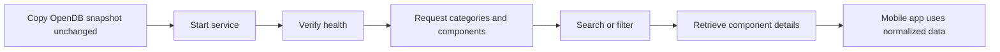
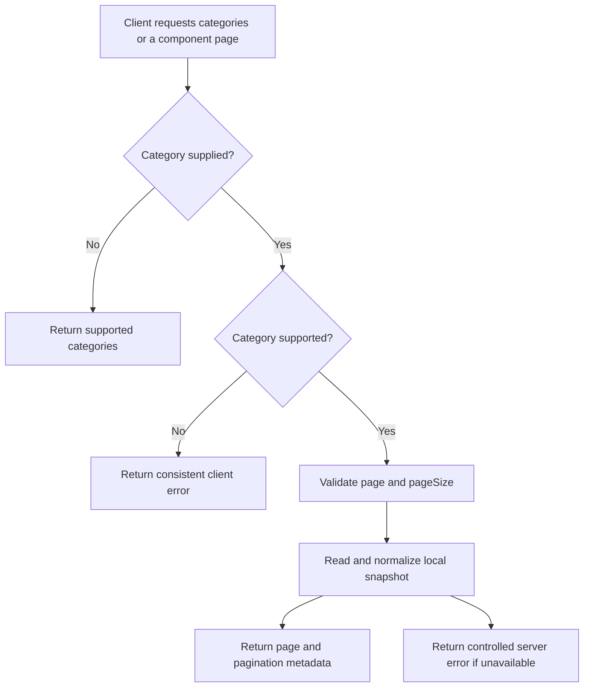
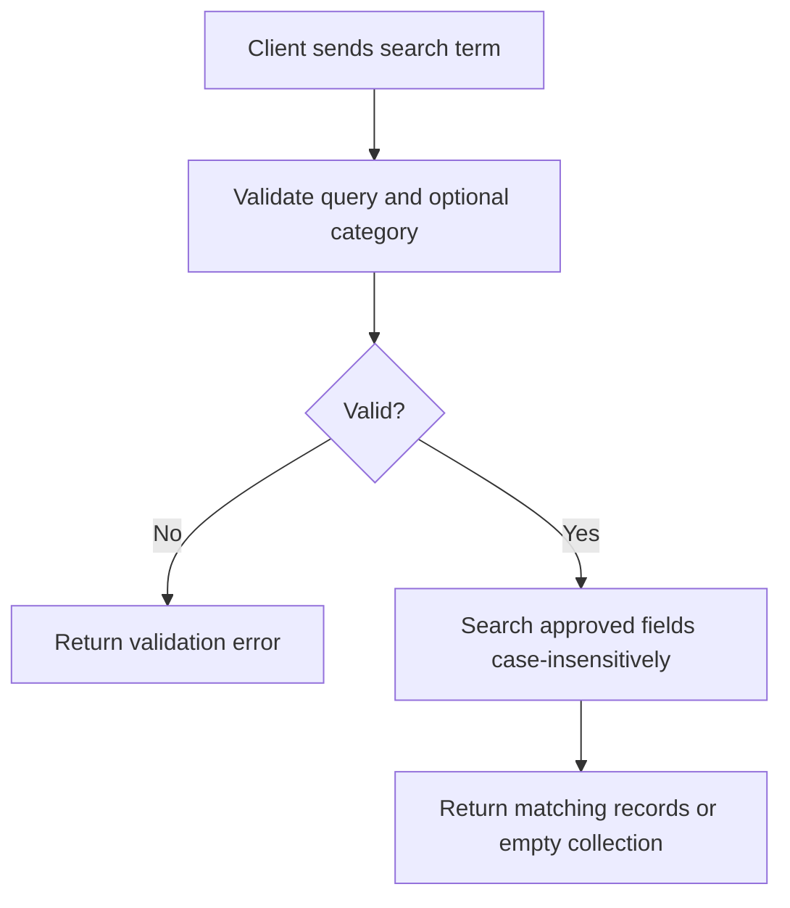
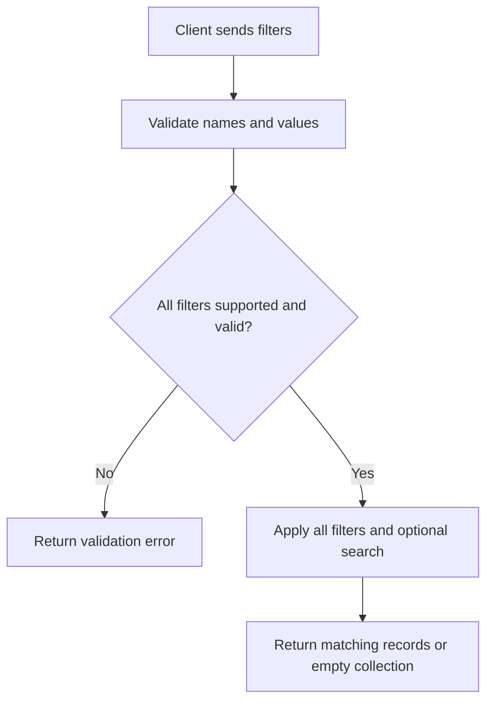
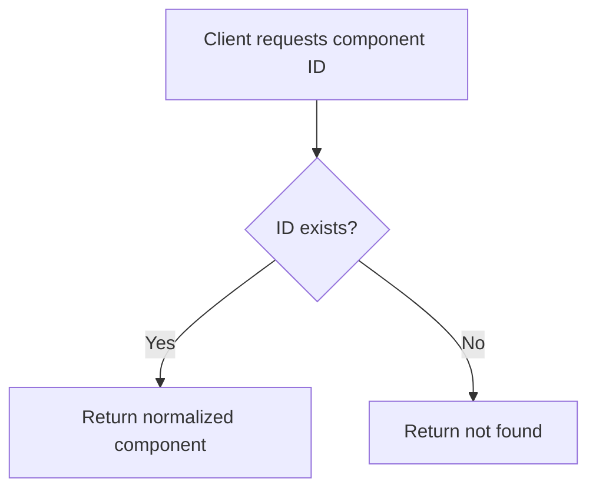
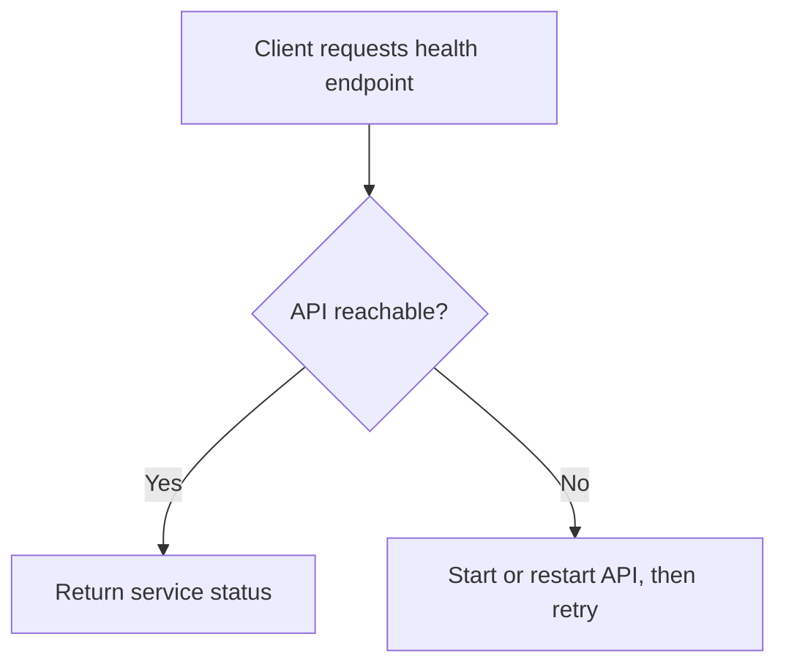

# User Journey

## 1. Purpose

Describe how the PCForge API is started, checked, and consumed by PCForge Mobile and its maintainers. This document contains the API user journeys and preserves the UF identifiers referenced by the product specification.

## 2. Primary Users

| User | Goals | Frustrations | Constraints |
| --- | --- | --- | --- |
| PCForge Mobile App | Retrieve normalized catalog data predictably | Unavailable service, inconsistent responses, or unsupported queries | Separate repository; read-only API; network access required |
| Student / Learner | Run and verify the API during class | Database setup or unclear startup failures | Node.js, TypeScript, Express, and pnpm; minimal setup; no external database |
| PCForge Developer | Maintain a stable, traceable catalog contract | Invalid source data or accidental contract changes | Static version-controlled JSON; stable component identifiers; testable behavior |

### User Assumptions

- BuildCores OpenDB data has been prepared and normalized before classroom use.
- The dataset is small enough to load into memory and is available when the API starts.
- API callers use the documented category names, query parameters, and component identifiers.
- The mobile application performs compatibility and power analysis; the API serves catalog data only.
- The API is read-only and does not require authentication or an external database for the MVP.

## 3. Overall User Journey

## 4. Individual Journeys

### Journey 01 — First-Time Setup

**Goal:** Start a local API instance that can serve the prepared catalog.  
**Trigger:** A learner or developer prepares the API for local use.  
**Preconditions:** The repository is scaffolded; the OpenDB folders have been downloaded and copied unchanged; Node.js and pnpm are available.

#### 4.1.1 Steps

1. The learner downloads the OpenDB folders and copies them into the project without modifying the source files.
2. The learner follows the repository's setup instructions and installs the project dependencies with pnpm.
3. The learner starts the API using the documented command.
4. The learner requests the health endpoint to verify service availability.
5. The learner or mobile app requests the supported categories to confirm catalog access.

#### 4.1.2 Decision Points

- Does the service start with the required dataset available?
- Does the health endpoint report success?
- Does the API expose the expected supported categories?

#### 4.1.3 Success State

The API is running locally and can serve requests without an external database.

#### 4.1.4 Failure / Edge Cases

- Dependencies or required runtime tools are unavailable.
- A required dataset file is missing or cannot be loaded.
- Dataset validation identifies an invalid record.
- The health endpoint cannot be reached because the service failed to start.

#### 4.1.5 Exit State

The learner proceeds to use the API, or restores the missing or invalid setup inputs before restarting.

### Journey 02 — Retrieve Component Catalog (UF-001)

**Goal:** Provide the mobile app with components for a supported category.  
**Trigger:** The app opens a category or requests the category list.  
**Preconditions:** The API is running and the relevant normalized dataset is available.

#### 4.2.1 Steps

1. The app requests the supported categories or a component category page, optionally setting `page` and `pageSize`.
2. The API validates the requested category when one is specified.
3. The service accesses the normalized dataset.
4. The API returns the requested page as JSON with total record and page counts. Page numbering starts at 1; page size defaults to 50 and accepts 10, 20, 30, 40, or 50.
5. The mobile app renders the response.

#### 4.2.2 Decision Points

- Is the category supported?
- Is the request for all categories or one category?
- Which page and allowed page size are requested?
- Are search or filter parameters included?

#### 4.2.3 Success State

The client receives the supported categories or a page of normalized components with pagination metadata; an empty category collection is a successful result.

#### 4.2.4 Failure / Edge Cases

- The client requests an unknown category and receives a consistent client error.
- A required dataset file is unavailable or cannot be loaded.
- The dataset contains no records for the requested category.
- The requested page is greater than the available page count; the response behavior remains to be decided.

#### 4.2.5 Exit State

The client displays the catalog results or handles the API error without reading backend files directly.

### Journey 03 — Search Components (UF-002)

**Goal:** Return matching components for a supported text query.  
**Trigger:** The user enters a search term in the mobile app.  
**Preconditions:** The query is valid; a category is valid if the search is category-scoped.

#### 4.3.1 Steps

1. The mobile app sends a search request, optionally scoped to a category.
2. The API validates the query parameters.
3. The service searches the approved normalized fields using case-insensitive matching.
4. The API returns the deterministic result collection.

#### 4.3.2 Decision Points

- Is the search across all categories or restricted to one category?
- Does the term match any supported searchable field?

#### 4.3.3 Success State

The client receives matching records, or an empty collection when there are no matches.

#### 4.3.4 Failure / Edge Cases

- An empty or otherwise invalid search term is rejected according to request validation.
- No records match the term.
- An invalid category is combined with the search request.

#### 4.3.5 Exit State

The client renders the results or corrects the request; search does not expose arbitrary filesystem paths or sources.

### Journey 04 — Filter Components (UF-003)

**Goal:** Return only records satisfying the requested supported specifications.  
**Trigger:** The user applies one or more filters.  
**Preconditions:** Each filter is supported for the selected category and has a valid value.

#### 4.4.1 Steps

1. The mobile app sends supported filter parameters, optionally with a search term.
2. The API validates filter names and value formats.
3. The service applies all requested filters to the catalog records.
4. The API returns the matching records.

#### 4.4.2 Decision Points

- Is each filter supported for this category?
- Are multiple filters combined, or is search also applied?
- Do any records satisfy all requested filters?

#### 4.4.3 Success State

The client receives only records satisfying all requested filters, including an empty collection when nothing matches.

#### 4.4.4 Failure / Edge Cases

- A filter name is unsupported for the category.
- A filter value has an invalid format.
- Invalid filters are rejected rather than silently ignored.

#### 4.4.5 Exit State

The client renders the filtered results or reports the validation error so the user can correct the query.

### Journey 05 — Retrieve Component Details (UF-004)

**Goal:** Retrieve the complete normalized record for one component.  
**Trigger:** The user opens a component detail view.  
**Preconditions:** The component identifier is available to the client.

#### 4.5.1 Steps

1. The mobile app requests `/api/components/:id` using the stable component identifier.
2. The API validates the identifier.
3. The service looks up the component.
4. The API returns the normalized record.

#### 4.5.2 Decision Points

- Does the identifier correspond to a component in the dataset?
- Was the component selected from a prior list response?

#### 4.5.3 Success State

The client receives one complete normalized component record.

#### 4.5.4 Failure / Edge Cases

- The identifier does not exist and the API returns a not-found response.

#### 4.5.5 Exit State

The client displays component details or presents a not-found state.

### Journey 06 — Verify API Availability (UF-005)

**Goal:** Determine whether the API process is reachable and operational.  
**Trigger:** The app starts or a learner/developer checks the service.  
**Preconditions:** The API process has been started.

#### 4.6.1 Steps

1. The client requests the health endpoint.
2. The API returns service status and basic metadata.
3. The client determines whether the service is available.

#### 4.6.2 Decision Points

- Is the process reachable?
- Does the response indicate successful service status?

#### 4.6.3 Success State

The caller can verify service availability without requesting component data.

#### 4.6.4 Failure / Edge Cases

- The API process is not running or cannot be reached.

#### 4.6.5 Exit State

The caller proceeds with catalog requests or starts/restarts the API before retrying.

## 5. Core User Flows

### Flow 01 — Retrieve Component Catalog (UF-001)

### Flow 02 — Search Components (UF-002)

### Flow 03 — Filter Components (UF-003)

### Flow 04 — Retrieve Component Details (UF-004)

### Flow 05 — Verify API Availability (UF-005)

## 6. Primary User Journey

### Rationale

Catalog retrieval is the API's primary purpose and the essential dependency for component discovery in PCForge Mobile. It exercises the service boundary without introducing database setup or exposing source files to the client.

### Steps

1. The learner starts the API and verifies its health.
2. The mobile app requests categories and loads a selected component collection.
3. The user searches or filters, then opens a component by its stable identifier.

### Critical Moments

- Local startup must not require an external database.
- Category names, stable IDs, and normalized response shapes must be predictable.
- Invalid query input must produce a clear, consistent client error.

### Friction / Risk

- Missing or malformed static data can prevent reliable catalog responses.
- Unavailable API connectivity blocks catalog features in the mobile app.
- Unsupported filter behavior can cause clients to interpret results incorrectly.

### Dependencies

- Node.js, pnpm, and documented startup instructions.
- An unchanged, version-controlled OpenDB JSON snapshot normalized by the API data adapter.
- A stable API contract consumed by the separate mobile repository.

## 7. UX Principles Derived from the Journey

| Principle | Journey Evidence / Rationale |
| --- | --- |
| Keep setup infrastructure-light | Learners must start the API without database configuration. |
| Make the contract deterministic | The mobile client relies on stable categories, IDs, and normalized records. |
| Reject ambiguity at the boundary | Unsupported filters and malformed values must not be silently accepted. |
| Preserve useful empty states | An empty category or no search matches is a valid result, not a service failure. |
| Keep failures actionable and safe | Callers need consistent errors without internal paths or implementation details. |

## 8. Future UX Validation

### Open Assumptions

- The final normalized schema and exact searchable fields are not yet frozen.
- Pagination and result bounds are still open decisions.
- Category-specific filters and allowed CORS development origins remain to be finalized.
- Dataset import and source-traceability exposure remain open decisions.

### Research Questions

- Can classmates start the API using only the documented setup steps?
- Can mobile developers understand and recover from validation, not-found, and service errors?
- Are the category names, filters, and result limits sufficient for the classroom catalog?

### Validation Methods

- Usability testing with classmates following setup instructions.
- API contract testing from the mobile client.
- Dataset validation and integration tests.
- User interviews with student API consumers and maintainers.

### Success Metrics

| Metric | Purpose | Target / Baseline |
| --- | --- | --- |
| Reproducible local startup | Confirm classroom setup is practical | At least two classmates start without a database |
| Health endpoint availability | Confirm service can be checked independently | Successful response after documented startup |
| Catalog contract success | Confirm the mobile app can retrieve required categories and records | All MVP catalog requests return contract-valid responses |
| Error consistency | Confirm invalid requests are recoverable | Representative failures use the standard JSON error structure |

## 9. Related Documentation

- [SPEC.md](SPEC.md)
- [REQUIREMENTS.md](REQUIREMENTS.md)
- `API.md`
- [USERJOURNEY.md](USERJOURNEY.md)
